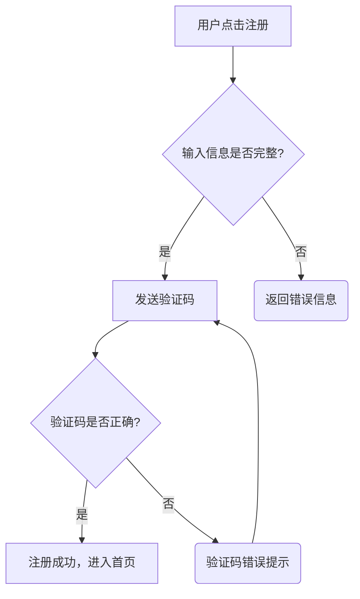

+++
title = "Mermaid 流程图测试"
date = 2025-12-14
description = "一个用于测试 Hugo PaperMod 主题中 Mermaid 集成是否成功的案例。"
mermaid = true # 关键：确保开启了 Mermaid 支持
+++

## 🌊 Mermaid 功能测试

此部分测试了流程图（Flowchart）和序列图（Sequence Diagram）的渲染。

### 1. 流程图 (Flowchart)

这是一个基本的流程图，用于展示一个简单的用户注册验证逻辑。

